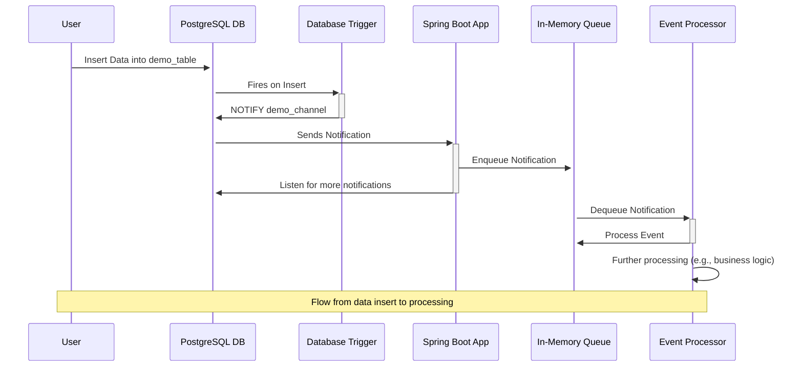

# Postgres NOTIFY-LISTEN

## Sequence of events


## Run Postgres Locally
Use the docker-compose.yml
```
docker-compose up -d
```
PGAdmin4 editor to interact with postgresdb
```
http://localhost:5050
```

## DB Scripts
### Create Script
```
CREATE DATABASE demo_db;

CREATE TABLE demo_table (
id SERIAL PRIMARY KEY,
data TEXT NOT NULL
);

CREATE OR REPLACE FUNCTION notify_demo_table_change() RETURNS TRIGGER AS $$
BEGIN
PERFORM pg_notify('demo_channel', row_to_json(NEW)::text);
RETURN NEW;
END;
$$ LANGUAGE plpgsql;

CREATE TRIGGER demo_table_after_insert
AFTER INSERT ON demo_table
FOR EACH ROW EXECUTE FUNCTION notify_demo_table_change();
```
### Query Triggers
```
SELECT
    trg.tgname AS trigger_name,
    tbl.relname AS table_name,
    ns.nspname AS schema_name,
    proc.proname AS procedure_name,
    pg_get_triggerdef(trg.oid) AS trigger_definition
FROM pg_trigger trg
JOIN pg_class tbl ON trg.tgrelid = tbl.oid
JOIN pg_namespace ns ON ns.oid = tbl.relnamespace
LEFT JOIN pg_proc proc ON proc.oid = trg.tgfoid
WHERE
    trg.tgisinternal = false;  -- Exclude internally used triggers by PostgreSQL
```
### Check Active 'LISTEN' Statements
```
SELECT * FROM pg_listening_channels();
```

## Run
```
mvn spring-boot:run
```

## Test
Insert the record using pgadmin
```
INSERT INTO demo_table (data) VALUES ('Hello, World');
```
Console will show
```
Received Notification: {"id":1,"data":"Hello, World"}
Processing: {"id":1,"data":"Hello, World"}
```